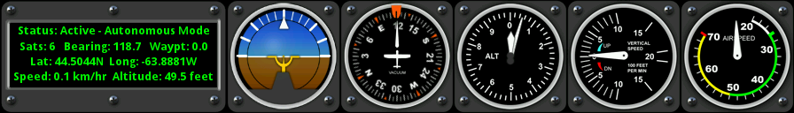
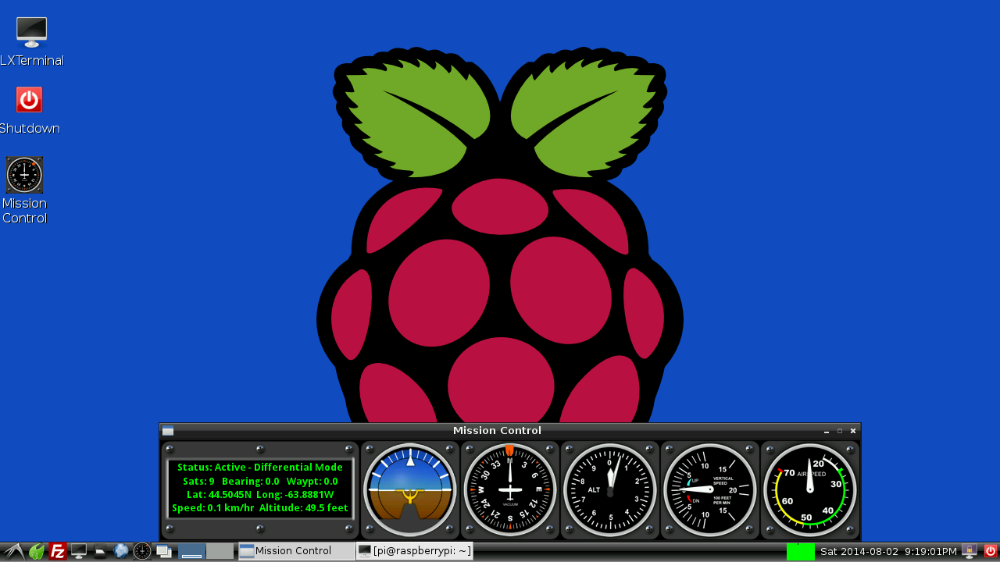
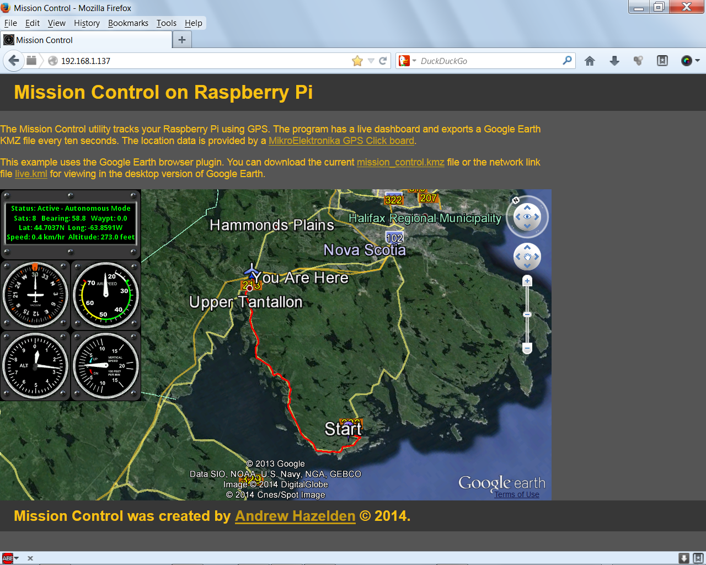
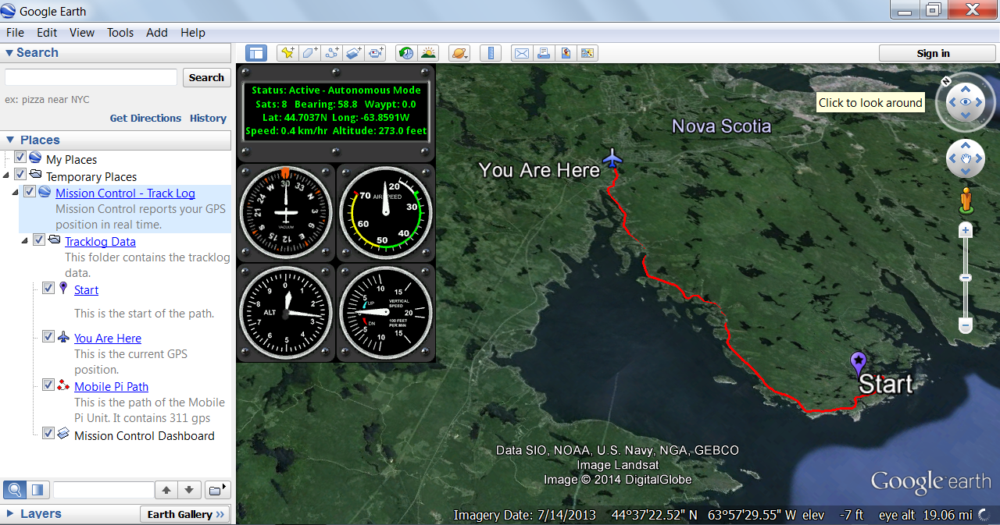
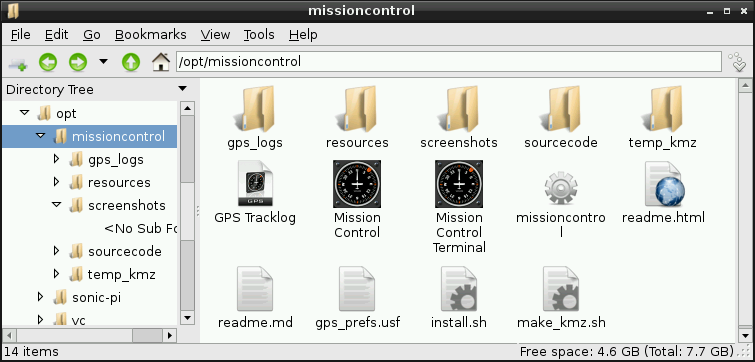
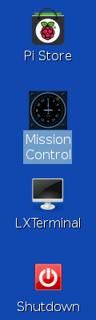
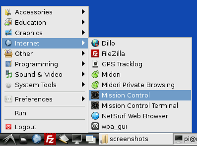

# Mission Control for Raspberry Pi #
Version 1.4.1 - Released 2014-02-08  
Created by Andrew Hazelden   
email: [andrew@andrewhazelden.com](mailto:andrew@andrewhazelden.com)  blog: [http://andrewhazelden.com](http://andrewhazelden.com)

Mission Control is a ground station program that allows you to plot the GPS based latitude, longitude, and altitude of your Raspberry Pi. The program has a graphical dashboard, and supports sharing the GPS position data via the internet using a Google Earth KMZ file. 

The live data for Mission Control is provided by a [MikroElektronika GPS Click board](http://www.mikroe.com/click/gps/ "GPS Click") that is connected to the [Raspberry Pi](http://www.raspberrypi.org/faqs "Raspberry Pi") via a USB connection on **/dev/ttyACM0**.

## Screenshots ##
  

You can track your position in real-time using Mission Control's SDL based dashboard display.

  

If you have the Google Earth WebView plugin installed you can track the Raspberry Pi in a remote web browser.

  

Mission Control also provides a KMZ export file that can be used in Google Earth. The KMZ file has a snapshot of the graphics dashboard and a waypoint log of the GPS Click's trail. The KMZ export is updated every 10 seconds.

## Installation ##

  

Once you unpack the Mission Control archive  you can install the software by running:  

    sudo sh ./install.sh  

This will copy the Mission Control software to the /opt/missioncontrol/ folder. The installer adds the SDL libraries and Apache using apt-get. This installer package is designed to be used with Raspbian.

The Apache web sharing folder is located at:

    /var/www/  

For this demo the raspberry pi should have the IP address set to **192.168.1.137** If you want to use a different IP address you need to update address stored in the HTML file:  

    /var/www/index.html  
    
You also need to update the Raspberry IP address stored in the kml file:

    /var/www/link.kml

A MissionControl.desktop shortcut is placed in the /home/pi/Desktop folder. The desktop item makes it easy to run Mission Control. 

The Mission Control program will launch and connect to the GPS Click via the /dev/ttyACM0 serial port connection at 115200.

The preferences for the Mission Control program are stored in a plain text preference file:  

    /opt/missioncontrol/gps_prefs.usf  

You can change the serial port device, and the baud rate in the **gps_prefs.usf** file.

# Starting Mission Control #

**Step 1.** Connect your [MikroElektronika GPS Click board](http://www.mikroe.com/click/gps/ "GPS Click") to the Raspberry Pi USB port.

**Step 2.** Double click on the "Mission Control" icon on your PI's desktop to start the program.

  

If you are using the Raspbian LXDE window manager, you can also start Mission Control with the **Internet > Mission Control** menu item. You can start Mission Control with the debugging info visible by running the **Internet Menu > Mission Control Terminal** menu item.

  

The raw NMEA GPS log file can be viewed with the **Internet Menu > GPS Tracklog** menu item. This command opens the /opt/missioncontrol/gps_log/tracklog.gps file in the nano text editor.

Mission Control can be started from the command line by typing the following command in the LXterminal:   

    /opt/missioncontrol/missioncontrol  

**Step 3.** At this point the Raspberry Pi system should show the live Mission Control gauges. 

You can now start your web browser on your desktop / laptop / mobile system and track the Raspberry PI using the Mission Control web interface. (You need to have Google Earth installed on your desktop to access the Mission Control webgui. )

Open your desktop system's web browser and access the Raspberry Pi's internet address:    

    http://192.168.1.137

If you want to view the Mission Control KMZ file directly in Google Earth you can download the current file using the URL:
    
    http://192.168.1.137/mission_control.kmz

A live network Google Earth KMZ file is accessible at:

    http://192.168.1.137/link.kmz

The link.kmz file is neat because it refreshes Google Earth regularly and downloads the latest Mission Control data.

A plain text NMEA GPS tracklog is saved on the Raspberry Pi at:  

    /opt/missioncontrol/gps_logs/tracklog.gps

This logfile is overwritten every time the Mission Control program is launched.

# Removing Mission Control #

If you want to remove Mission Control from your system you can run the following shell command:

    sudo sh /opt/missioncontrol/remove.sh

